# Arquitectura OpenClaw

## Diagrama de Componentes

```mermaid
flowchart TB
    subgraph Usuario["👤 Usuario"]
        U1[WebChat]
        U2[CLI]
        U3[macOS App]
        U4[Automatizaciones]
    end

    subgraph Gateway["🦞 Gateway (Daemon)"]
        direction TB
        WS[WebSocket Server<br/>127.0.0.1:18789]
        VAL[Validador JSON Schema]
        ROUT[Router de Eventos]
        CANVAS[Canvas Host<br/>/__openclaw__/canvas/]
        A2UI[A2UI Host]
        
        subgraph Providers["📡 Providers/Canales"]
            P1[WhatsApp<br/>Baileys]
            P2[Telegram<br/>grammY]
            P3[Slack]
            P4[Discord]
            P5[Signal]
            P6[iMessage]
        end
        
        subgraph Core["⚙️ Core"]
            AGENT[Agent Runner]
            CRON[Cron Scheduler]
            MEM[Memory Store]
        end
    end

    subgraph Nodes["📱 Nodes (Dispositivos)"]
        N1[macOS]
        N2[iOS]
        N3[Android]
        N4[Headless]
    end

    subgraph Skills["🛠️ Skills"]
        S1[weather]
        S2[browser]
        S3[web_search]
        S4[cron]
        S5[message]
        S6[canvas]
    end

    subgraph External["🌐 Servicios Externos"]
        E1[Anthropic API]
        E2[OpenAI API]
        E3[Otros LLMs]
    end

    %% Conexiones Usuario -> Gateway
    U1 -->|WebSocket| WS
    U2 -->|WebSocket| WS
    U3 -->|WebSocket| WS
    U4 -->|WebSocket| WS

    %% Gateway interno
    WS --> VAL
    VAL --> ROUT
    ROUT --> AGENT
    ROUT --> CRON
    ROUT --> MEM
    WS --> CANVAS
    WS --> A2UI
    
    %% Providers
    ROUT --> P1
    ROUT --> P2
    ROUT --> P3
    ROUT --> P4
    ROUT --> P5
    ROUT --> P6

    %% Nodes
    N1 -->|WebSocket<br/>role: node| WS
    N2 -->|WebSocket<br/>role: node| WS
    N3 -->|WebSocket<br/>role: node| WS
    N4 -->|WebSocket<br/>role: node| WS

    %% Agent -> Skills
    AGENT --> S1
    AGENT --> S2
    AGENT --> S3
    AGENT --> S4
    AGENT --> S5
    AGENT --> S6

    %% Agent -> LLMs
    AGENT --> E1
    AGENT --> E2
    AGENT --> E3

    %% Skills -> External
    S2 -->|Puppeteer/Playwright| E4[Páginas Web]
    S3 -->|Brave API| E5[Búsquedas]
```

## Diagrama de Flujo de Mensajes

```mermaid
sequenceDiagram
    actor User as Usuario
    participant Channel as Canal<br/>(Telegram/Discord/etc)
    participant GW as Gateway
    participant Agent as Agent Runner
    participant LLM as LLM API
    participant Skill as Skill

    User->>Channel: Envía mensaje
    Channel->>GW: Webhook/WS event
    GW->>GW: Valida & enruta
    GW->>Agent: Crea/continúa sesión
    
    Agent->>Agent: Carga contexto<br/>memoria + tools
    Agent->>LLM: Envía prompt<br/>+ tools disponibles
    LLM-->>Agent: Response + tool_calls
    
    loop Por cada tool_call
        Agent->>Skill: Ejecuta skill
        Skill->>Skill: Operación<br/>(buscar, navegar, etc)
        Skill-->>Agent: Resultado
        Agent->>LLM: Envía resultado
        LLM-->>Agent: Continúa
    end
    
    Agent-->>GW: Respuesta final
    GW->>Channel: Envía mensaje
    Channel->>User: Recibe respuesta
```

## Diagrama de Pairing (Nodos)

```mermaid
sequenceDiagram
    participant Node as Node<br/>(iOS/Android)
    participant GW as Gateway
    participant User as Usuario<br/>(Aprobador)

    Node->>GW: connect + deviceId<br/>+ challenge
    
    alt Local (loopback)
        GW-->>Node: Auto-aproved
    else Remoto
        GW->>User: Notificación: nuevo device
        User->>GW: approve device
    end
    
    GW-->>Node: device token
    Note over Node,GW: Conexión persistente<br/>WebSocket autenticado
    
    loop Comandos del nodo
        GW->>Node: canvas.present()
        Node-->>GW: screenshot/estado
    end
```

## Componentes Clave

| Componente | Función | Tecnología |
|------------|---------|------------|
| **Gateway** | Daemon principal, enrutador | Node.js, WebSocket |
| **Agent** | Ejecutor de tareas con LLM | Varies por modelo |
| **Skills** | Herramientas especializadas | Node.js, scripts |
| **Providers** | Conectores de mensajería | Baileys, grammY, etc |
| **Nodes** | Dispositivos con capacidades | iOS, Android, macOS |
| **Canvas** | UI renderizable por el agente | HTML/CSS/JS |
| **Memory** | Almacenamiento de contexto | File-based |

## Flujo de Autenticación

## Arquitectura de Skills

```mermaid
flowchart TB
    subgraph Skill["Skill Package"]
        direction TB
        SKILL_MD[SKILL.md<br/>Documentación]
        INDEX[skills/index.ts<br/>Entry point]
        TOOLS[tools/<br/>Herramientas]
        ASSETS[assets/<br/>Recursos]
    end

    AGENT[Agent Runner] -->|Carga| SKILL_MD
    AGENT -->|Ejecuta| INDEX
    INDEX -->|Usa| TOOLS
    INDEX -->|Sirve| ASSETS
```

## Notas de Arquitectura

- **Single Gateway**: Un solo daemon por host controla todos los canales
- **WebSocket**: Protocolo unificado para todos los clientes
- **Skills**: Plugins descubribles en runtime
- **Memory**: Continuidad entre sesiones via archivos markdown
- **Nodes**: Extensión de capacidades via dispositivos emparejados
